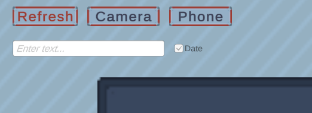

# Ganzin Glasses Streaming and Recording System

## Installation Guide

### Step 1: Install Dependencies

1. **Install Python 3**
   - Ensure Python 3 is installed on your system.
2. **Install OpenCV (cv2)**

   - For video streaming and recording, install OpenCV:
     ```bash
     pip install opencv-python
     ```

3. **Install Ganzin SDK**

   - The Ganzin SDK is required to interact with Ganzin glasses.
   - Download the following files (Confidential):
     - `ganzin_sol_sdk-1.0.1-py3-none-any.whl`
     - `examples.zip`
   - Install the SDK: 1. Extract the SDK files to a directory. 2. Open PowerShell in the SDK directory. 3. Run the following command:
     `bash
   pip install .\ganzin_sol_sdk-1.0.1-py3-none-any.whl
   ` 4. Install other packages that will be used later:
     `bash
   pip install requests
   `
     > **Note:** Please ask the repository maintainer for the Sol SDK installation files since they are confidential.

---

## Usage Instructions

### Step 2: Start the Python Server

1. Navigate to the Python server directory:
   ```bash
   cd ./Assets/PythonServer
   ```
2. Start the server:
   ```bash
   python server.py
   ```

### Step 3: Start the Unity Client

1. Launch the Unity client-side application.
2. Configure the **Device Select Settings** and **Filename Settings** here:
   

> **Note:** The `Glasses` option is only available if the server is connected to the Ganzin glasses server.

### Step 4: Recording

1. Press the `▶` button or the `Spacebar` to go to the recording page.
2. Use the on-screen buttons or press the `Spacebar` to:
   - Toggle recording.
   - Go through all gestures.

### Step 5: Exit

1. Press the `Exit` button on the Unity client.
2. Stop the Python server by entering `Ctrl+C` in the terminal where the server is running.

---

## Additional Notes

- For further assistance, contact the repository maintainer.
